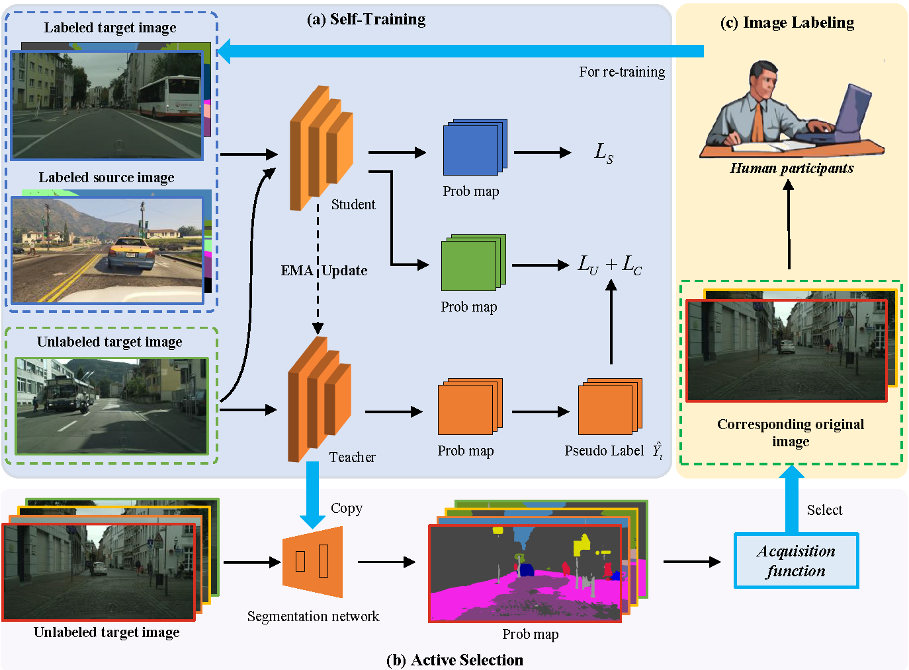
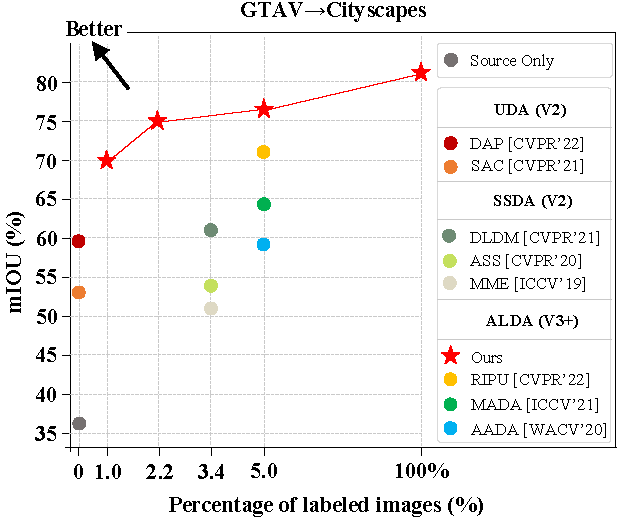

 ---

<div align="center"> 

# Iterative Loop Learning Combining Self-Training and Active Learning for Domain Adaptive Semantic Segmentation
by [Licong Guan](https://licongguan.github.io/), Xue Yuan

[](https://arxiv.org/abs/2301.13361)

</div>

This repository provides the official code for the paper [Iterative Loop Learning Combining Self-Training and Active Learning for Domain Adaptive Semantic Segmentation](https://arxiv.org/abs/2301.13361).


> **Abstract.** 
> Although data-driven methods have achieved great success in many tasks, it remains a significant challenge to ensure good generalization for different domain scenarios.
>Recently, self-training and active learning have been proposed to alleviate this problem. Self-training can improve model accuracy with massive unlabeled data, but some pseudo labels containing noise would be generated with limited or imbalanced training data. 
>And there will be suboptimal models if human guidance is absent. Active learning can select more effective data to intervene, while the model accuracy can not be improved because the massive unlabeled data are not used. 
>And the probability of querying sub-optimal samples will increase when the domain difference is too large, increasing annotation cost. 
>This paper proposes an iterative loop learning method combining Self-Training and Active Learning (STAL) for domain adaptive semantic segmentation. 
>The method first uses self-training to learn massive unlabeled data to improve model accuracy and provide more accurate selection models for active learning. 
>Secondly, combined with the sample selection strategy of active learning, manual intervention is used to correct the self-training learning. 
>Iterative loop to achieve the best performance with minimal label cost. 
>Extensive experiments show that our method establishes state-of-the-art performance on tasks of GTAV→Cityscapes, SYNTHIA→Cityscapes, improving by 4.9% mIoU and 5.2% mIoU, compared to the previous best method, respectively. 





For more information on STAL, please check our **[[Paper](https://arxiv.org/pdf/2301.13361.pdf)]**.

## Results
### GTAV to Cityscapes

We have put our model checkpoints here [[Google Drive]()] [[百度网盘]()] (提取码`STAL`).

| Method                      | Net | budget | mIoU | Chekpoint | Where in Our [Paper](https://arxiv.org/abs/2301.13361) |
| --------------------------- | --------- | --------- | --------- | --------- | ----------- |
| STAL                     | V3+     | 1%     | 70.0     | [Google Drive]()/[BaiDu]()     | Table1     |
| STAL                     | V3+     | 2.2%  | 75.0     | [Google Drive]()/[BaiDu]()     | Table1     |
| STAL                     | V3+     | 5.0%  | 76.1     | [Google Drive]()/[BaiDu]()     | Table1     |


### SYNTHIA to Cityscapes

| Method                      | Net | budget | mIoU | Chekpoint | Where in Our [Paper](https://arxiv.org/abs/2301.13361) |
| --------------------------- | --------- | --------- | --------- | --------- | ----------- |
| STAL                     | V3+     | 1%     | 73.2     | [Google Drive]()/[BaiDu]()     | Table1     |
| STAL                     | V3+     | 2.2%  | 76.0     | [Google Drive]()/[BaiDu]()     | Table1     |
| STAL                     | V3+     | 5.0%  | 76.6     | [Google Drive]()/[BaiDu]()     | Table1     |


## Installation

```bash
git clone https://github.com/licongguan/STAL.git && cd STAL
conda create -n stal python=3.6.9
conda activate stal
pip install -r requirements.txt
pip install pip install torch==1.8.1+cu102 torchvision==0.9.1+cu102 -f https://download.pytorch.org/whl/torch_stable.html
```

## Usage

#### Data Preparation

<details>
  <summary>For Cityscapes</summary>

Download "leftImg8bit_trainvaltest.zip" from: https://www.cityscapes-dataset.com/downloads/

Download "gtFine.zip" from: https://drive.google.com/file/d/10tdElaTscdhojER_Lf7XlytiyAkk7Wlg/view?usp=sharing

Next, unzip the files to folder ```data``` and make the dictionary structures as follows:

```angular2html
data/cityscapes
├── gtFine
│   ├── test
│   ├── train
│   └── val
└── leftImg8bit
    ├── test
    ├── train
    └── val
```

</details>


<details>
  <summary>For SYNTHIA</summary>

Refer to [this link](https://synthia-dataset.net/) and download ```SYNTHIA``` dataset.

And unzip the files to folder ```data``` and make the dictionary structures as follows:

```angular2html
data/synthia
├── RAND_CITYSCAPES
    ├── Depth
    ├── GT
    └── RGB

```
</details>


## License

This project is released under the [Apache 2.0](LICENSE) license.

## Acknowledgement

We reproduce our STAL based on **RIPU**  and U<sup>2</sup>PL on branch ```with_AEL```.
- RIPU: https://github.com/BIT-DA/RIPU
- U<sup>2</sup>PL: https://github.com/Haochen-Wang409/U2PL

Thanks a lot for their great work!

## Citation
If you find this project useful in your research, please consider citing:
```bibtex
@article{guan2023iterative,
  title={Iterative Loop Learning Combining Self-Training and Active Learning for Domain Adaptive Semantic Segmentation},
  author={Guan, Licong and Yuan, Xue},
  journal={arXiv preprint arXiv:2301.13361},
  year={2023}
}
```

## Contact
- Licong Guan, lcguan941@bjtu.edu.cn
